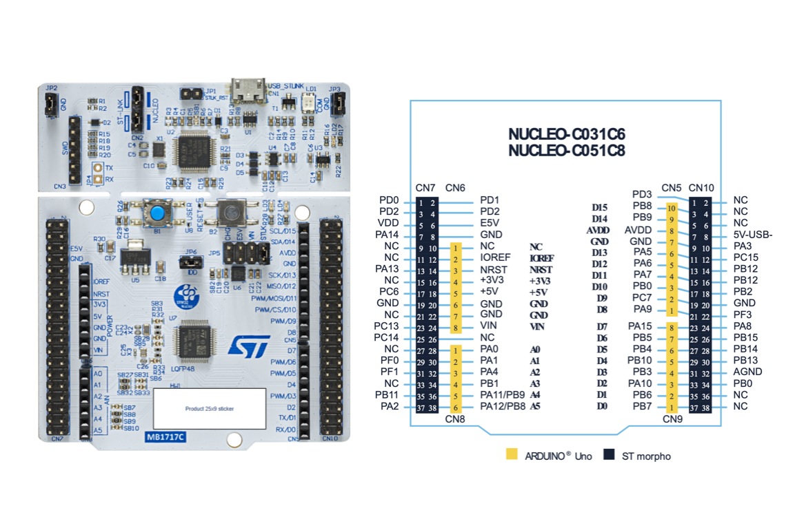

# Repository Description
This repository is intended to illustrate how C++ programing can be used for the firmware development in the embedded engineering projects. This repository is not following the straightforward way of using the stm32 chip for development which is through [StmcubeIDE](https://www.st.com/en/development-tools/stm32cubeide.html). Rather, a combination of register level interfaces called [CMSIS](https://www.arm.com/technologies/cmsis), board files from the STM, and MAKE is used as the build system. Further, the build system would be accessible within a docker build environment. THis is a work in progress and it's actively being updated!

Hardware used for personal testing is NUCLEO-C031C6, please update the hardware speicifc dependencies for the firmware build if you are building for a different MCU.

### NOTE
In order to check your developments using a snaity check, you can install the STM32CubeIDE to build and flash the projects. However, the imporatn thing is (at least what I experienced for MAC installation) there would be no examples or pre-made project after the IDE installtion. To get the examples, you would need to install the STM32CubeC0 patch from [here](https://github.com/STMicroelectronics/STM32CubeC0?utm_source=chatgpt.com).

## Build System
The build system that we aim to use for this repository is a bare-metal mode with CMSIS files copied over from the STM32CubeC0 patch. There a few more files that I had to copy over to make the build work out. Particularly, the files are:

    CMSIS
    syscalls.c
    linker.ls
    starup.s
    header files

Another piece of the build system is the Makefile which enables us to output .elf file for programing. Finally, we would need to install the tool chain to compile the output. We use the Arm GNU Toolchain that can be downloaded from [here](https://developer.arm.com/downloads/-/arm-gnu-toolchain-downloads) where the version I am using is this: `arm-gnu-toolchain-15.2.rel1-darwin-arm64-arm-none-eabi.pkg`

After, installation add the tool chain to the system path and make sure the tool chains is up and ready. You should see the info by putting this: 

`arm-none-eabi-gcc --version`.

## Flashing Tool
Unfortunately, I tried to use openOCD to flash the .elf image, but the board I am using is not supported. So, I resorted to use the [STM32CubeProgrammer](https://www.st.com/en/development-tools/stm32cubeprog.html). NOTE: Dont forget to check 'run after programmin' and 'verify programming'!